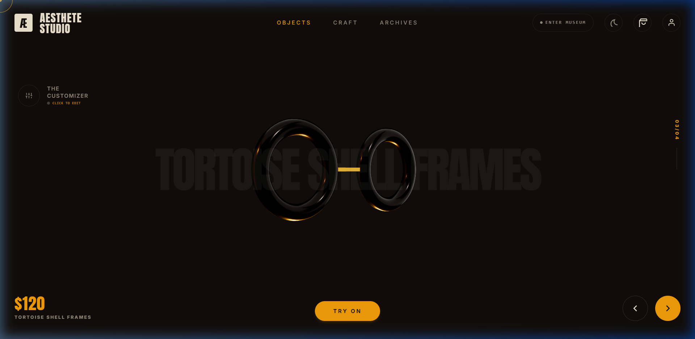
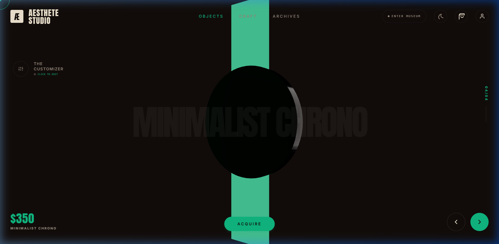
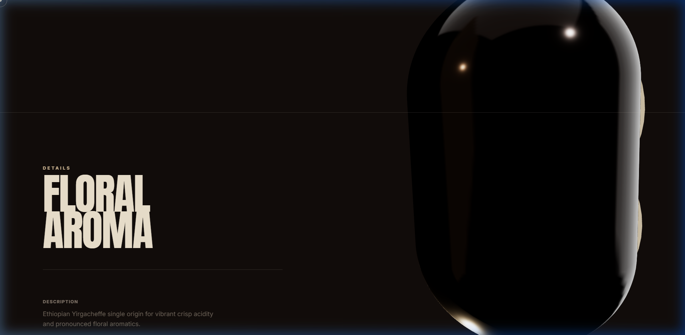
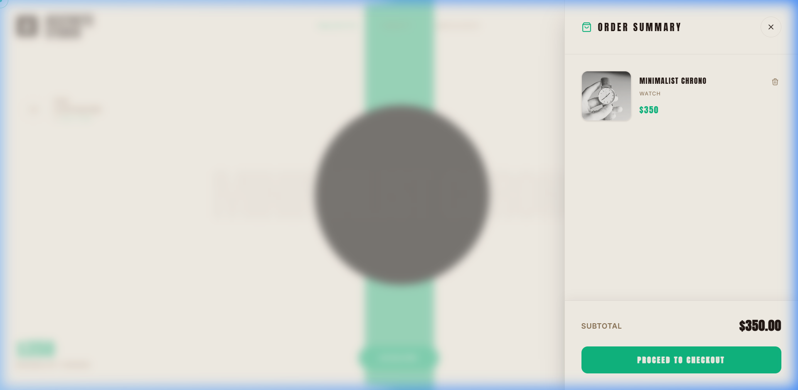

# 🌟 Aesthete Studio - Premium 3D Animated E-Commerce

Aesthete Studio is an ultra-modern, immersive 3D conceptual e-commerce landing page and product showcase. Driven by a sensory-rich design philosophy, the interface dynamically morphs its three-dimensional models, typography, metrics, and global color themes based on the selected product category. 

Designed for high-end artisan products—including **Design Books, High-end Glasses, Luxury Watches, and Specialty Coffee**—this project demonstrates how three-dimensional WebGL rendering and physics-based interactions can elevate modern web commerce.

---

## 📽️ Interactive Showcase

Behold the smooth GSAP scroll animations, 3D geometric product morphing, theme toggles, and cart drawers in action:

<div align="center">
  
</div>

---

## ✨ Features & Visual Highlights

### 🎨 Dynamic Contextual Theming
The website dynamically adjusts its entire styling, directional canvas lighting, and accent colors based on the chosen category. Switch between Dark and Light mode seamlessly.

| 🕶️ Tortoise Shell Glasses (Light Mode) | ⌚ Minimalist Watch (Dark Mode) |
| :---: | :---: |
|  |  |

### 🛠️ Interactive Three.js WebGL Canvas (`HeroCanvas.tsx`)
A procedural 3D model engine renders real-time 3D geometry representing the core design of each product:
- **Torus** for high-end glasses
- **Cylinder** for luxury watches
- **Box** for design books
- **Capsule** for artisan coffee

The geometries adapt smoothly using scroll-linked progress indicators, providing high-performance 60 FPS rotation and translation.

### 📜 Kinetic Scroll-Triggered Layouts
Leverages **Lenis Smooth Scroll** and **GSAP ScrollTrigger** to orchestrate fluid DOM animations. Large typography, detail cards, grid layouts, and highlight metrics glide gracefully into view as the user scrolls.

| 📊 Product Detail Specs | 🛒 Slide-out Cart Drawer |
| :---: | :---: |
|  |  |

---

## 🛠️ Tech Stack & Architecture

### Frontend
- **React 18 & Vite**: Lightning-fast compilation and optimized asset delivery.
- **Tailwind CSS**: Theme-adaptable design system and responsive grid structures.
- **Three.js / React Three Fiber (R3F)**: Declarative, reactive 3D scene builder.
- **React Three Drei**: Helpers and abstractions for high-fidelity WebGL stages, cameras, and controls.
- **GSAP & ScrollTrigger**: State-of-the-art scroll animations.
- **Lenis**: Buttery smooth native scrolling.
- **Lucide React**: Premium icon sets.

### Backend & Database
- **Express.js & Node**: Rest APIs for user authentication, product catalogs, and cart checkouts.
- **Prisma ORM**: Modern database schema client mapping to a persistent store.
- **SQLite**: Local relational database configuration.
- **Google OAuth SSO**: Beautiful OAuth sandbox flow with automatic switch to live credentials.

---

## 🚀 Getting Started

### Prerequisites
Ensure you have [Node.js](https://nodejs.org/) installed.

### 1. Install Dependencies
```bash
npm install
```

### 2. Configure Environment Variables
Copy `.env.example` into a new file named `.env` or `.env.local` and add your keys:
```bash
GEMINI_API_KEY=your_gemini_api_key_here
```

### 3. Initialize & Seed Database
If the database file does not exist, the server will automatically run migration checks and seed initial product items. To seed or reset manually:
```bash
npx prisma db push
npx tsx prisma/seed.ts
```

### 4. Run the Application
Start the unified Express-Vite dev server:
```bash
npm run dev
```
Open **[http://localhost:3000](http://localhost:3000)** in your browser to view the application.

---

## 🗄️ Database Schema Overview

```prisma
model Product {
  id             Int     @id @default(autoincrement())
  category       String  // coffee, book, glasses, watch
  name_en        String
  name_ar        String
  description_en String
  description_ar String
  price          Float
  image_url      String?
  accent_color   String? @default("#ceb693")
  theme          String? @default("dark")
}

model User {
  id        Int      @id @default(autoincrement())
  email     String   @unique
  password  String?  // null for Google SSO
  name      String?
  createdAt DateTime @default(now())
}
```

---

*Made with 💖 for a beautiful e-commerce experience.*
